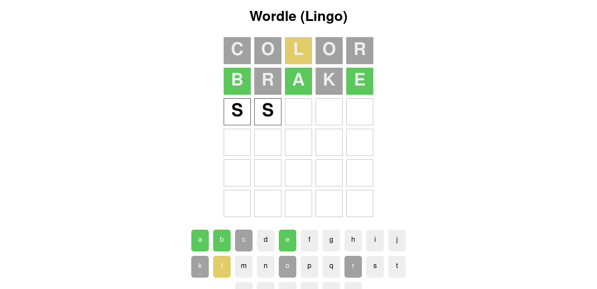

# The Net Ninja - Wordle App

This is a project from a video tutorial on how to create a Wordle clone using React.

The Net Ninja helps black-belt your web development skills.

## Table of contents

- [Overview](#overview)
  - [Screenshot](#screenshot)
- [My process](#my-process)
  - [Built with](#built-with)
  - [What I learned](#what-i-learned)
  - [Continued development](#continued-development)

## Overview

### Screenshot



## My process

### Built with

- CSS custom properties
- CSS Grid
- CSS Animation
- [React](https://reactjs.org/) - JS library

### What I learned

CSS flip & bounce animation

```css
.row > div.green {
  --background: #5ac85a;
  --border-color: #5ac85a;
  animation: flip 0.5s ease forwards;
}
.row > div.grey {
  --background: #a1a1a1;
  --border-color: #a1a1a1;
  animation: flip 0.6s ease forwards;
}
.row > div.yellow {
  --background: #e2cc68;
  --border-color: #e2cc68;
  animation: flip 0.5s ease forwards;
}
.row > div:nth-child(2) {
  animation-delay: 0.2s;
}
.row > div:nth-child(3) {
  animation-delay: 0.4s;
}
.row > div:nth-child(4) {
  animation-delay: 0.6s;
}
.row > div:nth-child(5) {
  animation-delay: 0.8s;
}
.row.current > div.filled {
  animation: bounce 0.2s ease-in-out forwards;
}

@keyframes flip {
  0% {
    transform: rotateX(0);
    background: #fff;
    border-color: #333;
  }
  45% {
    transform: rotateX(90deg);
    background: white;
    border-color: #333;
  }
  55% {
    transform: rotateX(90deg);
    background: var(--background);
    border-color: var(--border-color);
  }
  100% {
    transform: rotateX(0deg);
    background: var(--background);
    border-color: var(--border-color);
    color: #eee;
  }
}

@keyframes bounce {
  0% {
    transform: scale(1);
    border-color: #ddd;
  }
  50% {
    transform: scale(1.2);
  }
  100% {
    transform: scale(1);
    border-color: #333;
  }
}
```

Create undefined array to make mock undefined components.

```javascript
const [guesses, setGuesses] = useState([...Array(6)]);
```

### Continued development

Play again button after game ended.
